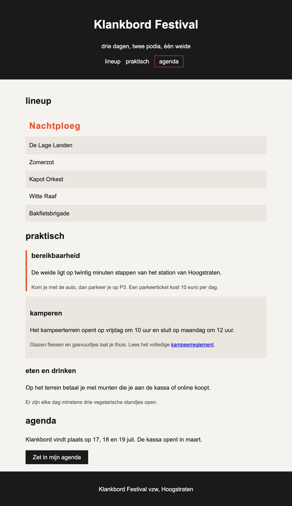

# pseudo-festival

In deze oefening stijl je de festivalpagina `index.html` volledig met **pseudo-classes**. Je
gebruikt er negen, in één pagina. De pseudo-classes voor formulieren (`:required`, `:valid` en
`:invalid`) laat je buiten beschouwing: formulieren komen later in de cursus aan bod.

Lees eerst de theorie over [pseudo selectors](https://webtechnologie.apload.be/css/selectors/pseudo-selectors).

De startbestanden staan al klaar:

```
pseudo-festival/
├─ index.html
└─ css/
   └─ normalize.css        (modern-normalize)
```

Maak zelf `css/style.css` aan. In de `head` van `index.html` staat de `link` ernaar al klaar, **na** die van `normalize.css`.

> **LET OP**: je werkt hier **bovenop normalize**, niet bovenop een reset. De nuttige
> browserstijlen blijven dus staan: koppen zijn al groot en vet, de `ol` heeft al nummers, links
> zijn al blauw en onderlijnd. Schrijf enkel wat je écht anders wil. Haal `normalize.css` niet weg
> en pas het niet aan.

De HTML van `index.html` mag je **niet** aanpassen. Alles wat hieronder gevraagd wordt, los je op
in CSS. Dat is net het punt van deze oefening: je hebt geen extra `class`, `span` of `div` nodig.

## deel 1: basisopmaak

Zonder pseudo-selectoren, gewoon om de pagina leesbaar te maken:

* `body`
  * lettertype Arial, Helvetica, sans-serif
  * regelhoogte van 1.6
  * tekstkleur `#1a1a1a` op een achtergrond `#f5f3ef`
* `main`
  * breedte van 700px, horizontaal gecentreerd
  * padding van 20px
* `header` en `footer`
  * padding van 20px
  * gecentreerde tekst op een achtergrond `#1a1a1a` met witte tekst
* `nav ul`
  * geen opsommingstekens
  * geen inspringing links
  * de drie items staan naast elkaar (gebruik hier `display: inline-block` op de `li`)
  * 10px ruimte rechts van elk item
* `nav a`
  * witte tekst, niet onderlijnd

## deel 2: de navigatie

**`:hover`**

Ga je met de muis over een link in de navigatie, dan:

* krijgt de link de kleur `#e4572e`
* en wordt hij onderlijnd

**`:focus`**

Navigeer je met de `Tab`-toets door de pagina, dan moet je zien waar je staat. Geef de link die de
focus heeft een `outline` van 3px in `#e4572e`.

> **LET OP**: haal een focus-stijl nooit weg zonder er iets anders in de plaats te zetten.
> Gebruikers die met het toetsenbord werken zien anders niet meer waar ze zijn.

**`:last-child`**

De laatste link van de navigatie ("agenda") is de belangrijkste en ziet uit als een knopje:

* selecteer het laatste `li` van `nav ul` met `:last-child`
* de link erin krijgt 6px padding boven en onder, 12px links en rechts, en een rand van 1px in
  `#e4572e`

> **TIP**: `:last-child` zet je op de `li`, niet op de `a`. Elke `a` is namelijk het enige kind van
> zijn `li`, en dus **altijd** het laatste kind.

## deel 3: de lineup

De lineup is een genummerde lijst (`ol.lineup`). Pas aan:

* `.lineup`
  * geen nummers meer (`list-style: none`), geen inspringing links
* elke `li`
  * padding van 10px
  * een onderrand van 1px in `#ddd`

**`:first-child`**

De eerste naam in de lijst is de headliner:

* tekst van 24px in het vet
* in de kleur `#e4572e`
* met een letterafstand (`letter-spacing`) van 1px

**`:nth-child()`**

Geef de **even** items een achtergrond `#ebe7e0`. Gebruik het sleutelwoord `even`, niet `2n`.

**`:last-child`**

Het laatste item heeft **geen** onderrand meer.

**`:hover`**

Ga je met de muis over een item, dan krijgt dat item een achtergrond `#e4572e` met witte tekst.

> **TIP**: zet deze regel **onder** die van `:nth-child(even)`. Beide selectors zijn even
> specifiek, dus de regel die als laatste in je bestand staat, wint (zie
> [voorrangsregels](https://webtechnologie.apload.be/css/cascade)).

## deel 4: praktische info

De sectie `#praktisch` bevat een `h2` en daarna drie `article`-elementen. Elk `article` bevat een
`h3` en twee `p`. In het tweede artikel staat een link naar het kampeerreglement.

**`:first-of-type`**

Het eerste artikel is het belangrijkste:

* een linkerrand van 4px in `#e4572e`
* 12px padding links

**`:nth-of-type()`**

* de **tweede** paragraaf van elk artikel staat in `#555` en in 14px
* schrijf dit met `:nth-of-type(2)` op de `p` binnen een `article`

**denkvraag**: waarom werkt `article:nth-child(1)` hier **niet** om het eerste artikel te
selecteren, terwijl `article:first-of-type` wel werkt? Zet je antwoord als CSS-commentaar boven de
regel.

## deel 5: artikels met een link

**`:has()`**

Eén van de drie artikels bevat een link. Dat artikel moet opvallen, maar je mag de HTML niet
aanpassen en er staat geen `class` op. Met een gewone selector kan je enkel "naar beneden" kijken,
dus je hebt `:has()` nodig: die selecteert een element op basis van wat het **bevat**.

* selecteer in `#praktisch` elk `article` dat een `a` bevat
* geef het 12px padding en een achtergrond `#ebe7e0`

Controleer dat enkel het artikel "kamperen" verandert.

## deel 6: de knop

Onder de agenda staat een knop. Geef hem een basisstijl: padding van 10px 20px, achtergrond
`#1a1a1a`, witte tekst, geen rand en een handje als muisaanwijzer.

**`:active`**

Zolang je de muisknop op de knop ingedrukt houdt, krijgt de knop een achtergrond `#e4572e`.

## controleer je werk

Loop dit lijstje af. Elke selector moet minstens één keer in je `style.css` staan:

| | pseudo-class | waar |
| --- | --- | --- |
| 1 | `:hover` | nav-links en lineup-items |
| 2 | `:focus` | de nav-links |
| 3 | `:active` | de knop |
| 4 | `:first-child` | de headliner |
| 5 | `:last-child` | nav en lineup |
| 6 | `:nth-child()` | de even lineup-items |
| 7 | `:nth-of-type()` | de tweede paragraaf per artikel |
| 8 | `:first-of-type` | het eerste artikel |
| 9 | `:has()` | het artikel met een link |

De pseudo-classes `:required`, `:valid` en `:invalid` heb je hier **niet** nodig, en ook de
pseudo-elementen `::before` en `::after` komen in deze oefening niet aan bod.

## Verwacht resultaat


